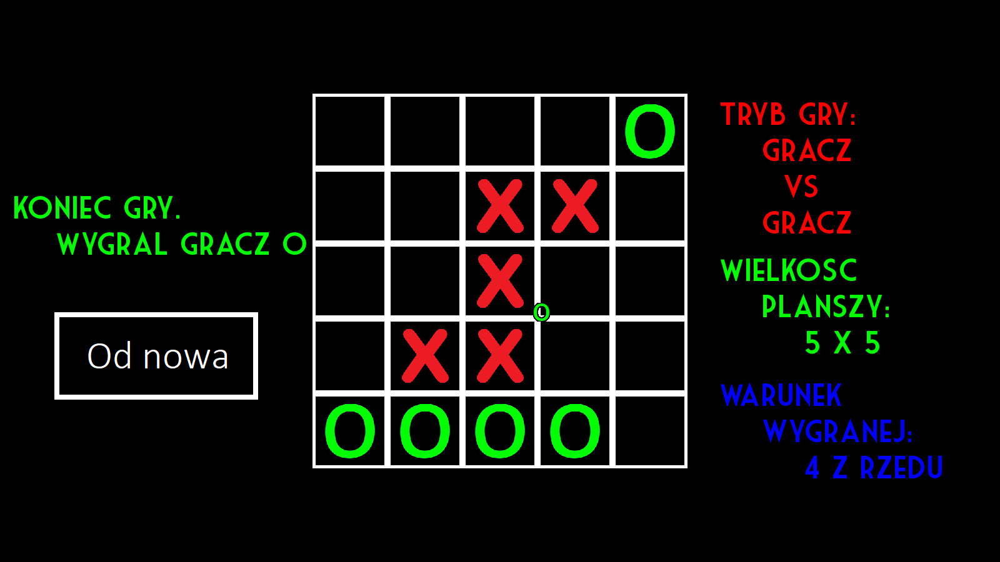

# Advanced Tic‑Tac‑Toe
Classical game with a graphical user interface – enriched with adjustable board sizes, win conditions, and gameplay versus computer.

[Polish version of readme](/README_pl.md)

---

## Project description
Project is an implementation of popular game called "tic-tac-toe" with advanced features such as:
- Graphical user interface using SFML library.
- Min‑max algorithmthat that allows playing versus computer.
- Adjustable board sizes and win conditions.

---

## Final result
Image below presents the game during a match on 5x5 board when the win condition requires 4 symbols in a row.

---

